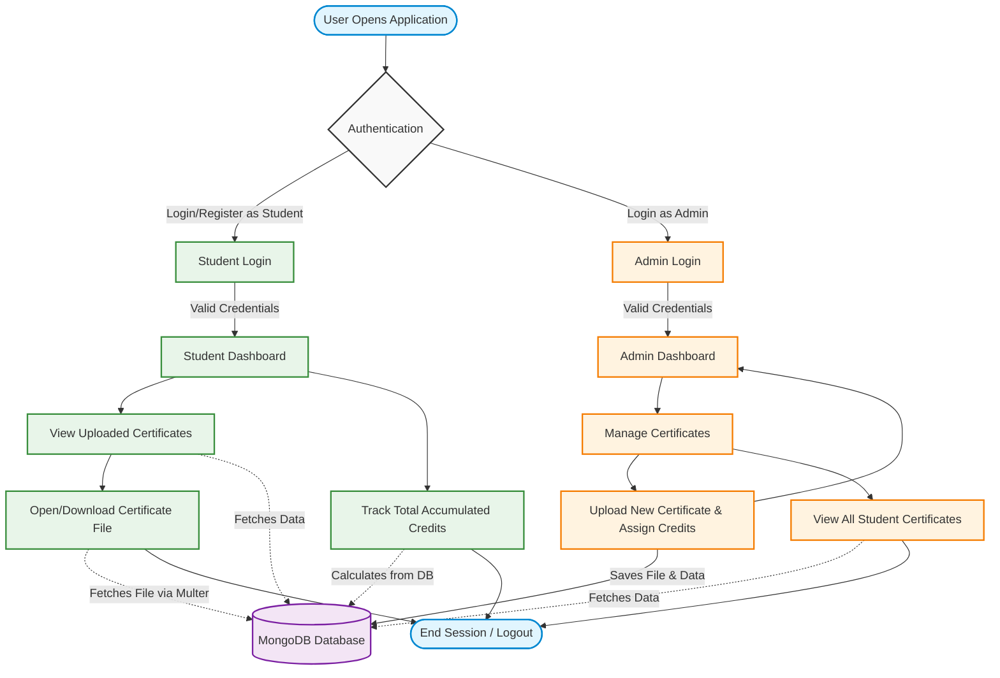

# Application Workflow Diagram

The following diagram illustrates the primary user flow for both **Administrators** and **Students** within the Student Certification Management System.

```mermaid
flowchart TD
    %% Main Entry
    Start([User Opens Application]) --> Auth{Authentication}
    
    %% Authentication Split
    Auth -->|Login/Register as Student| StudentLogin[Student Login]
    Auth -->|Login as Admin| AdminLogin[Admin Login]

    %% Student Flow
    StudentLogin -->|Valid Credentials| StudentDash[Student Dashboard]
    StudentDash --> ViewCerts[View Uploaded Certificates]
    StudentDash --> ViewCredits[Track Total Accumulated Credits]
    ViewCerts --> ViewFile[Open/Download Certificate File]
    
    %% Admin Flow
    AdminLogin -->|Valid Credentials| AdminDash[Admin Dashboard]
    AdminDash --> ManageCerts[Manage Certificates]
    ManageCerts --> UploadCert[Upload New Certificate & Assign Credits]
    ManageCerts --> ViewAllCerts[View All Student Certificates]
    
    %% Backend/DB Interactions
    UploadCert -->|Saves File & Data| Database[(MongoDB Database)]
    ViewAllCerts -.->|Fetches Data| Database
    ViewCerts -.->|Fetches Data| Database
    ViewCredits -.->|Calculates from DB| Database
    ViewFile -.->|Fetches File via Multer| Database
    
    %% End States
    ViewFile --> EndFlow([End Session / Logout])
    ViewCredits --> EndFlow
    ViewAllCerts --> EndFlow
    UploadCert --> AdminDash
    
    %% Styling
    classDef default fill:#f9f9f9,stroke:#333,stroke-width:2px;
    classDef startend fill:#e1f5fe,stroke:#0288d1,stroke-width:2px;
    classDef student fill:#e8f5e9,stroke:#388e3c,stroke-width:2px;
    classDef admin fill:#fff3e0,stroke:#f57c00,stroke-width:2px;
    classDef db fill:#f3e5f5,stroke:#7b1fa2,stroke-width:2px;

    class Start,EndFlow startend;
    class StudentLogin,StudentDash,ViewCerts,ViewCredits,ViewFile student;
    class AdminLogin,AdminDash,ManageCerts,UploadCert,ViewAllCerts admin;
    class Database db;
```
